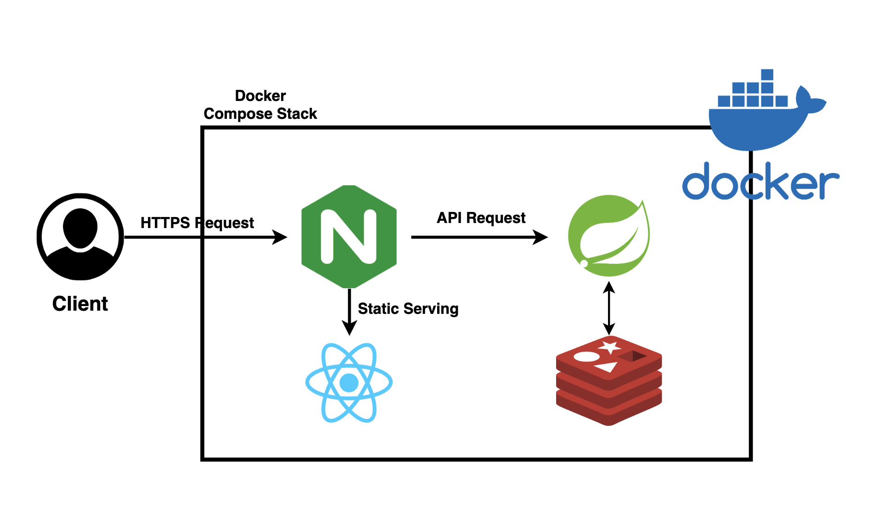
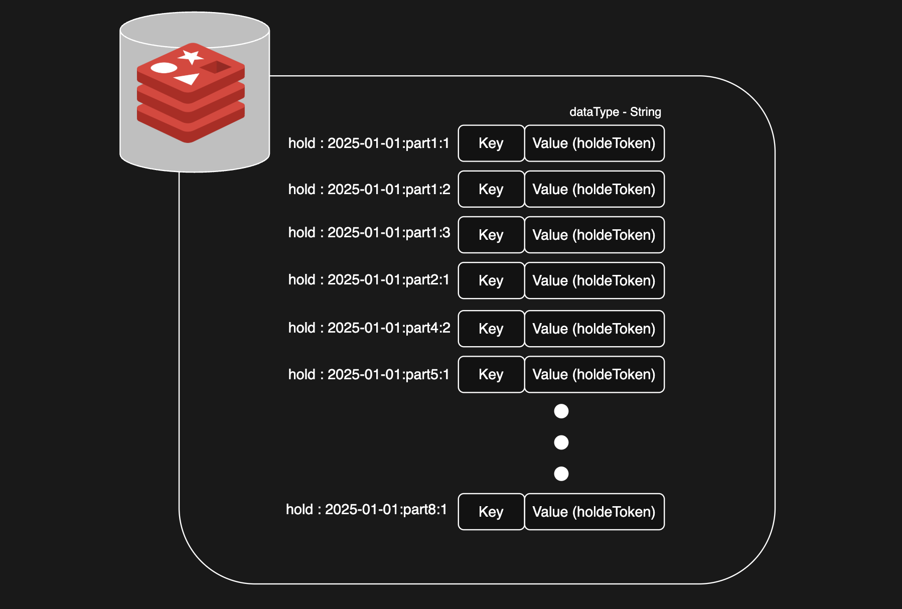
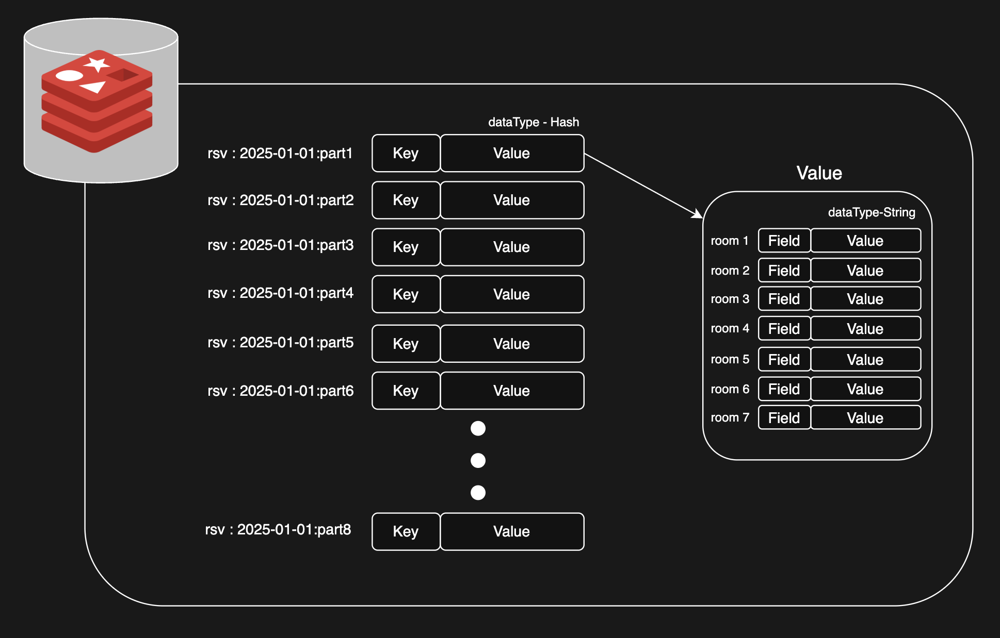

# MeetHub ⏰ ( 회의실 예약 웹 서비스 )
**Redis를 주 저장소로 사용해 “당일 회의실 예약”을 중복 없이 처리하는 예약 웹 서비스입니다.** 

## 🔗 바로가기
- **Service**: [meethub.inwoohub.com](https://meethub.inwoohub.com/)
- **API Docs (Swagger)**: [Swagger UI](https://meethub.inwoohub.com/swagger-ui/index.html)

---

## 0. 목차
> 1.  [👨‍💻 프로젝트 개요](#sec-1-overview)
> 2.  [⚒️ 사용 기술](#sec-2-tech)
> 3.  [🌐 아키텍처](#sec-3-arch)
> 4.  [🖥️ 화면 구성](#sec-4-ui)
> 5.  [📌 주요 기능 설계](#sec-5-feature)
> 6.  [⚠️ 트러블 슈팅](#sec-6-trouble)

---

## 1. 👨‍💻 프로젝트 개요
### 1-1. 소개
MeetHub는 칠판에 이름을 적던 회의실 예약을 웹으로 디지털화한 **당일 예약 서비스**입니다.  
Redis를 주 저장소로 사용하고 **Hold + Lua 원자 처리 + TTL(자정 만료)** 로 중복 예약과 일일 초기화를 해결했습니다.

### 1-2. 기간
- **2025.12 ~ 2026.01** (약 1개월)
### 1-3. 배경
- 칠판 예약: 현황 공유 어려움, 변경/취소 처리 번거로움
- 동일한 기준으로 예약 현황을 공유할 수 있는 웹 기반 예약 방식 필요

### 1-4. 개발 목표
- 칠판 예약을 웹으로 전환하여 **당일 예약 현황을 한 화면에서 공유**
- **중복 예약/동시성 문제를 0%로 방지**하는 예약 확정 로직 구현
- Redis를 **주 저장소(Primary Store)** 로 사용하며 키 설계/자료구조/TTL 운영 경험
- Hold(선점) 기반 UX와 **Lua Script 원자 처리**로 안정적인 예약 흐름 구현

#### 1-4-1. Redis 선택 이유
MeetHub는 “당일 예약” 특성상 **동시성(중복 예약) 제어**와 **자정 초기화(TTL)** 가 핵심입니다.  
Redis는 `TTL`과 `Lua Script`로 예약 확정 흐름을 단순하게 **원자 처리**할 수 있어 주 저장소로 선택했습니다.  
또한 Redis를 캐시가 아닌 **데이터 저장소 관점(키 설계, TTL, 원자 처리)** 으로 설계·운영해보는 것을 학습 목표로 포함했습니다.

### 1-5. 팀원 소개

| 황인우 | 김소정 |
| :---: | :---: |
|  |  |
| [Github](https://github.com/inwoohub) | [Github](https://github.com/cowjeong) |
| **BE & FE** | **BE & FE** |
| Redis 키 설계(예약/Hold/TTL)   Hold(선점)   Lua Script(원자 처리)   Admin API   전역 예외 처리   배포(Nginx/HTTPS/도메인)   FE 보조(UI/연동 일부) | 예약 CRUD   예약 화면/플로우 설계   Lua Script(원자 처리)   FE 메인(UI/상태관리/연동) |

## 2. ⚒️ 사용 기술

## 3. 🌐 아키텍처

### 3-1. 시스템 아키텍처

### 3-2. Redis 데이터 모델 (키 설계)
- Hold(String) + Reservation(Hash) 구조로 동시성/만료 정책을 구현했습니다.

#### 3-2-1. 선점 키 (Hold)
- Key: `hold:{date}:{slot}:{room}` / Type: String / TTL: 300초

#### 3-2-2. 예약 키 (Reservation)
- Key: `rsv:{date}:{slot}` / Type: Hash / Field: room(1~7) / Value: JSON / TTL: 자정 만료 

## 4. 🖥️ 화면 구성

## 5. 📌 주요 기능 설계
### 5-1. 전역 예외 처리

### 5-2. 선점 기능 (Hold)

### 5-3. 예약 기능 (CRUD)

### 5-4. 관리자 기능 (Admin)

## 6. ⚠️ 트러블슈팅

 

---
